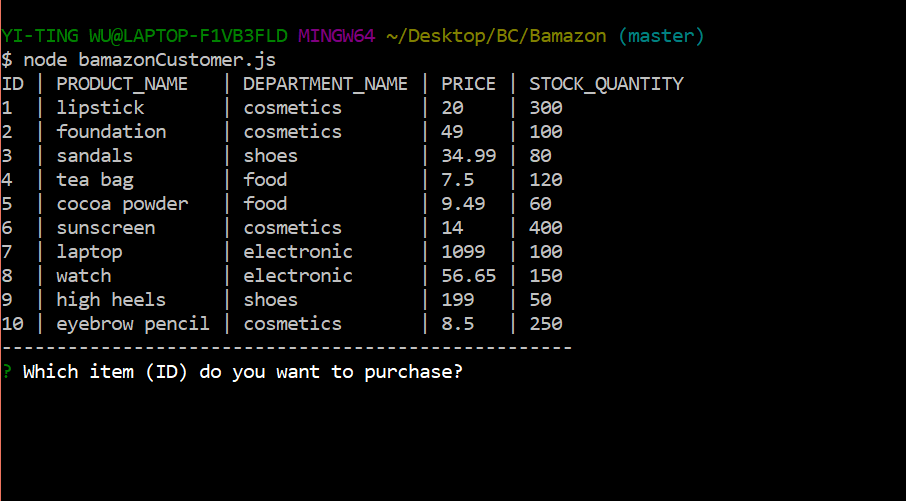
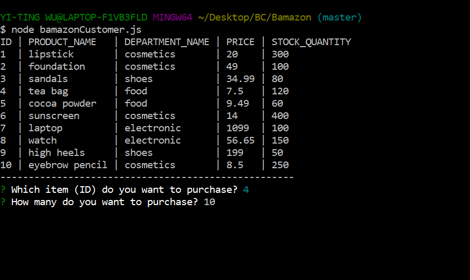

# Bamazon

This is an app that mocks the online shopping website --- Amazon, where you will be able to make an order using the command line prompt and input.

When you open the app, you will see a list of items that shows stuff on sale. You will then see a prompt question asking which item you want to purchase, and how many you want to purchase.

